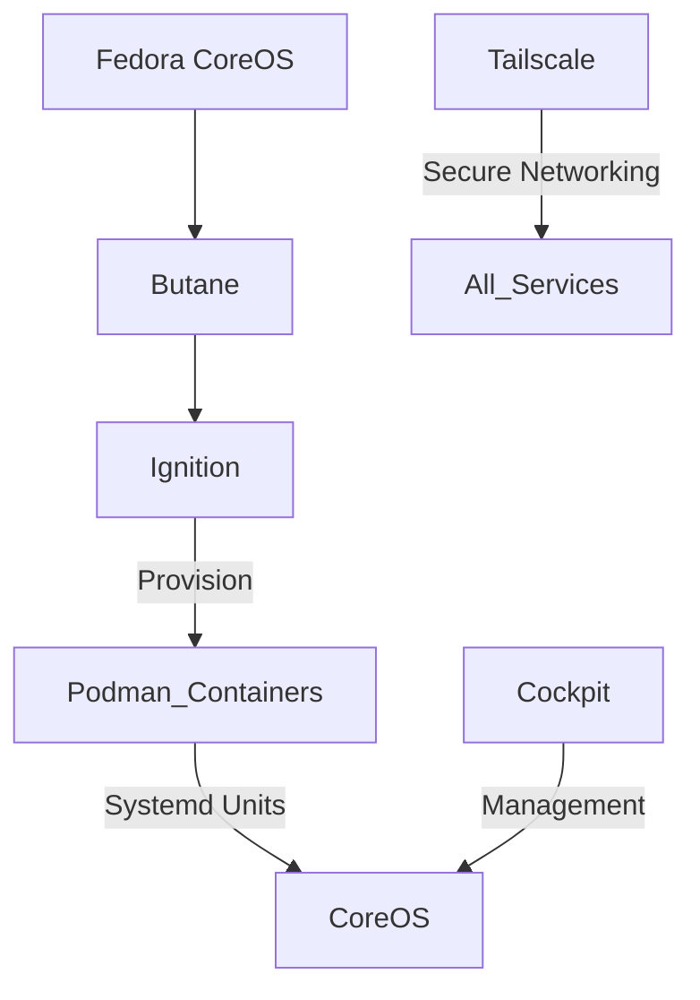

# Homelab Infrastructure as Code

A declarative Fedora CoreOS homelab configuration managed with Butane and Podman.

## What’s Implemented Today

- Base FCOS provisioning with Butane:
  - central.bu.yml defines hostname, zram, Zincati update window, and merges per-service Ignition snippets.
- Services (declarative, per-service directories):
  - Cockpit: system console for host management (services/cockpit/) — https://cockpit-project.org/
  - Tailscale: secure mesh VPN for remote access (services/tailscale/) — https://tailscale.com/
  - Kinto: JSON storage micro-service (services/kinto/) — https://github.com/Kinto/kinto
- Build flow:
  - just build transpiles each *.bu.yml into build/.../*.ign using the Butane container.
  - central.bu.yml references those generated .ign via ignition.config.merge.
- Utilities:
  - justfile with tasks to build, format, serve artifacts, and test in QEMU.

## Architecture Overview



## Core Components

- Fedora CoreOS (Immutable OS with automated updates)
- Butane configurations for declarative provisioning
- Podman containers with systemd integration
- Cockpit web console for management
- Tailscale mesh VPN for secure access

## Networking & Security
- Tailscale mesh VPN for secure service exposure
- Vaultwarden (Bitwarden-compatible password manager)
- SOPS + Age for secrets management

## Service Catalog

### Knowledge Management
- [Atomic Server](https://github.com/atomicdata-dev/atomic-server)
- [AFFiNE](https://github.com/toeverything/AFFiNE) - [Docker Compose docs](https://docs.affine.pro/self-host-affine/install/docker-compose-recommend) - ********

### Web & Bookmarks
- Ideally would be able to archive pages for offline reading, keep list of links, maintain metadata about a link, screenshot/preview, shorten links
- [Shiori](https://github.com/go-shiori/shiori) - Bookmarks
- [Grimoire](https://github.com/goniszewski/grimoire) - Bookmarks
- [Servas](https://github.com/beromir/Servas) - Bookmarks

### Security
- [Vaultwarden](https://github.com/dani-garcia/vaultwarden) - Password Manager
- [SOPS](https://github.com/getsops/sops) - Dev Secrets (investigate AGE, too)

### Micro-apps
- [Kinto](https://github.com/Kinto/kinto/) - [Storage docs](https://docs.kinto-storage.org/en/stable/) - JSON storage

### DX
- [Gitea](https://github.com/go-gitea/gitea)
- [Forgejo](https://codeberg.org/forgejo/forgejo)

### Productivity
- Excalidraw?
- TODO tracker?
- [Basic docs wiki](https://github.com/suitenumerique/docs)
- [Waypipe](https://gitlab.freedesktop.org/mstoeckl/waypipe) - Remote software

## Repository Structure

```
homelab/
├── central.bu.yml          # Base system configuration
├── justfile                # Task runner commands
├── services/               # Service-specific configurations
│   ├── cockpit/            # Management console
│   ├── kinto/              # JSON storage service
│   └── tailscale/          # VPN configuration
└── README.md               # This documentation
```

## Getting Started

### Prerequisites
- Fedora CoreOS target (bare metal, VM, or cloud)
- Podman and just on your workstation
- Tailscale account/network if enabling Tailscale

### Build
- Transpile all Butane configs to Ignition:
  - just build
- The outputs are written as:
  - build/services/**/service.ign (per service)
  - build/central.ign (when you run the explicit step below)

To explicitly generate the final Ignition for the host:
- just build-central

Alternatively, directly:
- just transpile_ign central.bu.yml build/central.ign

### Deploy

- Using coreos-installer (e.g., to a disk /dev/sdX):
  - just coreos_installer 'install --ignition-file build/central.ign /dev/sdX'

- Quick QEMU smoke test:
  - just download_fcos
  - just deploy_fcos_qemu

### Management

- Validate all Butane configs strictly:
  - just validate-configs

- List services discovered in services/* and referenced by central.bu.yml:
  - just list-services

- Format YAML and justfile:
  - just format

- Serve build artifacts locally (http://localhost:8000):
  - just serve

## Operations

- Immutable Infrastructure: Fedora CoreOS + declarative Butane configs
- GitOps: All changes via this repository; rebuild Ignition and reprovision as needed
- Backups: TODO — choose and document (e.g., restic or borg)
- Monitoring: TODO — basic node metrics and service health
- Secrets: TODO — integrate SOPS + age and document the build-time decryption step

## Current Gaps / TODO

- Define secrets workflow (keys, encryption, decryption in build)
- Document ports, volumes, and environment for each service
- Add CI to validate Butane and optionally boot a VM for smoke testing
- Add backup plan and simple monitoring/alerts

## References

- Butane Getting Started: https://coreos.github.io/butane/getting-started/
- Butane FCOS v1.6 Config: https://coreos.github.io/butane/config-fcos-v1_6/
- Fedora CoreOS: https://docs.fedoraproject.org/en-US/fedora-coreos/
- Podman systemd unit integration: https://docs.podman.io/en/latest/markdown/podman-systemd.unit.5.html
- Cockpit on CoreOS: https://cockpit-project.org/running.html#coreos
- Cockpit project: https://cockpit-project.org/
- Tailscale: https://tailscale.com/
- Kinto: https://github.com/Kinto/kinto
- Just Task Runner manual: https://just.systems/man/en/
- Gitea Actions Guide: https://chrisliebaer.de/blog/gitea-actions/
- age project (issue on host key integration): https://github.com/FiloSottile/age/issues/578
