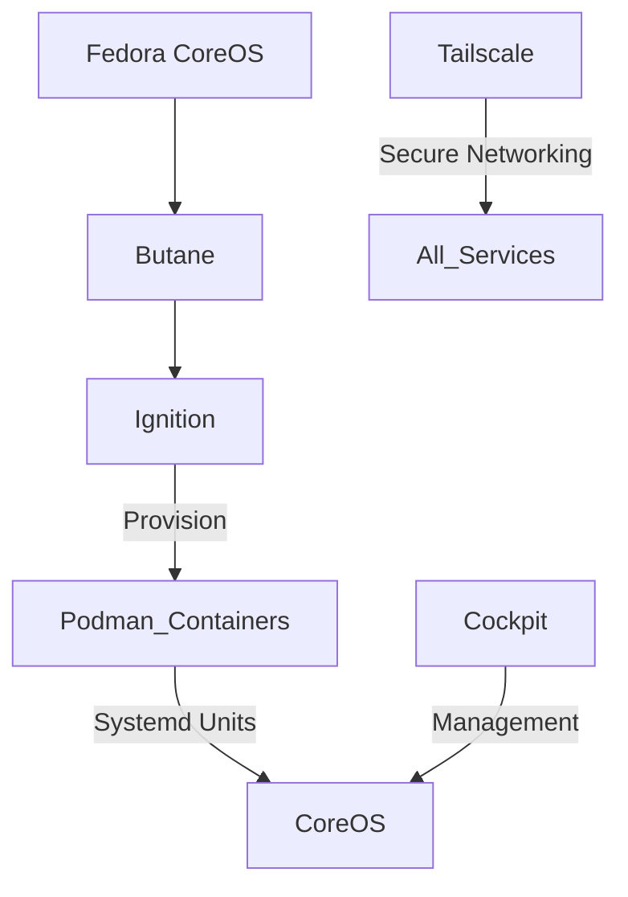

# Homelab Infrastructure as Code

A declarative Fedora CoreOS homelab configuration managed with Butane and Podman.

## Architecture Overview



## Core Components

### Infrastructure Foundation
- Fedora CoreOS (Immutable OS with automated updates)
- Butane configurations for declarative provisioning
- Podman containers with systemd integration
- Cockpit web console for management

### Networking & Security
- Tailscale mesh VPN for secure service exposure
- Vaultwarden (Bitwarden-compatible password manager)
- SOPS + Age for secrets management

## Service Catalog

### Knowledge Management
- [Atomic Server](https://github.com/atomicdata-dev/atomic-server)
- [AFFiNE](https://github.com/toeverything/AFFiNE) - [Docker Compose docs](https://docs.affine.pro/self-host-affine/install/docker-compose-recommend) - ********

### Web & Bookmarks
- Ideally would be able to archive pages for offline reading, keep list of links, maintain metadata about a link, screenshot/preview, shorten links
- [Shiori](https://github.com/go-shiori/shiori) - Bookmarks
- [Grimoire](https://github.com/goniszewski/grimoire) - Bookmarks
- [Servas](https://github.com/beromir/Servas) - Bookmarks

### Security
- [Vaultwarden](https://github.com/dani-garcia/vaultwarden) - Password Manager
- [SOPS](https://github.com/getsops/sops) - Dev Secrets (investigate AGE, too)

### Micro-apps
- [Kinto](https://github.com/Kinto/kinto/) - [Storage docs](https://docs.kinto-storage.org/en/stable/) - JSON storage

### DX
- [Gitea](https://github.com/go-gitea/gitea)
- [Forgejo](https://codeberg.org/forgejo/forgejo)

### Productivity
- Excalidraw?
- TODO tracker?
- [Basic docs wiki](https://github.com/suitenumerique/docs)
- [Waypipe](https://gitlab.freedesktop.org/mstoeckl/waypipe) - Remote software

## Repository Structure

```
homelab/
├── central.bu.yml          # Base system configuration
├── justfile                # Task runner commands
├── services/               # Service-specific configurations
│   ├── cockpit/            # Management console
│   ├── kinto/              # JSON storage service
│   └── tailscale/          # VPN configuration
└── README.md               # This documentation
```

## Getting Started

### Prerequisites
1. Fedora CoreOS host
2. Butane compiler (`butane` command)
3. Tailscale network configured

### Deployment Example
```bash
# Generate Ignition config
butane --pretty --strict central.bu.yml > ignition.json

# Apply to CoreOS
fcct -input ./central.bu.yml -output ./ignition.json
```

### Management
```bash
# Use Just commands for common tasks
just validate-configs  # Validate Butane configs
just list-services     # Show managed services
```

## Operational Excellence
- **Immutable Infrastructure**: CoreOS + Declarative Butane configs
- **GitOps Approach**: All changes through repository
- **Backup Strategy**: (TODO: Add backup plan)
- **Monitoring**: (TODO: Add monitoring solution)

## References

### Core Technologies
- [Butane Getting Started](https://coreos.github.io/butane/getting-started/)
- [Butane FCOS v1.6 Config](https://coreos.github.io/butane/config-fcos-v1_6/)
- [Fedora CoreOS OS Extensions](https://docs.fedoraproject.org/en-US/fedora-coreos/os-extensions/)
- [Podman Systemd Integration](https://docs.podman.io/en/latest/markdown/podman-systemd.unit.5.html)
- [Fedora CoreOS Documentation](https://docs.fedoraproject.org/en-US/fedora-coreos/)

### Additional Resources
- [Cockpit on CoreOS](https://cockpit-project.org/running.html#coreos)
- [Gitea Actions Guide](https://chrisliebaer.de/blog/gitea-actions/)
- [Just Task Runner Manual](https://just.systems/man/en/)
- [Age Encryption Issue #578](https://github.com/FiloSottile/age/issues/578)
